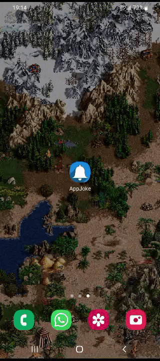

### Hi, I'm Yakov 👋 Welcome to my GitHub!

### 💻 Skills:

  &nbsp
  &nbsp
  &nbsp
  &nbsp
  &nbsp
  &nbsp
  &nbsp;

---

### Projects overview:

<table>
  <tr>
    <td width='440px' align='center' valign='middle'>
      
    </td>
    <td width='400px'>
      <h3>Application Cinema</h3>
      
Explore new releases, save collections, share with friends, search for films, and get actor information - all in one place

      

        <a href='https://github.com/Yakov-Nechaev/Portfolio-projects/tree/main/AppCinema'>Go to GitHub repository</a>
      

      
Libraries and technologies:

      <ul>
        <li>Model-View-ViewModel</li>
        <li>Coroutines</li>
        <li>Retrofit, SQL</li>
        <li>Glide</li>
        <li>Shared preference store</li>
        <li>ViewPager for onboarding</li>
        <li>RecyclerView, Pagination, DiffUtil</li>
      </ul>
    </td>
  </tr>

<tr>
    <td width='440px' align='center' valign='middle'>
      
    </td>
    <td width='400px'>
      <h3>Application Electric Charge Finder</h3>
      
App displays charging stations for electric vehicles on the map, making it easy to find a charging spot for your EV

      

        <a href='https://github.com/Yakov-Nechaev/Portfolio-projects/tree/main/AppCharger'>Go to GitHub repository</a>
      

      
Libraries and technologies:

      <ul>
        <li>Model-View-ViewModel</li>
        <li>Google Maps integration</li>
        <li>Location Permissions handling</li>
        <li>Di Koin</li>
        <li>Coroutines</li>
        <li>Retrofit, SQL</li>
        <li>Glide</li>
        <li>Day and Night Mode (Theme)</li>
      </ul>
    </td>
  </tr>

<td width='440px' align='center' valign='middle'>
      
    </td>
    <td width='400px'>
      <h3>Application Jokes</h3>
      
The user can choose their preferred categories, set the frequency of receiving joke notifications, and save their favorites

      

        <a href='https://github.com/Yakov-Nechaev/Portfolio-projects/tree/main/AppJoke'>Go to GitHub repository</a>
      

      
Libraries and technologies:

      <ul>
        <li>Room</li>
        <li>Model-View-ViewModel</li>
        <li>Background mode</li>
        <li>Coroutine Worker</li>
        <li>Broadcast Receiver</li>
        <li>Alarm Manager</li>
        <li>Retrofit, SQL</li>
      </ul>
    </td>
  </tr>

</table>

---
